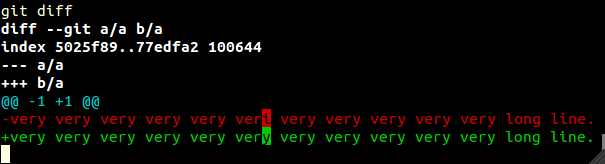

<ol data-toc></ol>

#Sources

- official book: <http://git-scm.com/book>.

    Good info and graphs.

    Leaves out many practical things.

- good tut: <http://cworth.org/hgbook-git/tour/>

- good tut, straight to the point, ASCII diagrams: <http://www.sbf5.com/~cduan/technical/git/git-1.shtml>

- good tut by GitHub: <http://learn.github.com/p/>

- description of a production / dev / hotfix branch model: <http://nvie.com/posts/a-successful-git-branching-model/>

#Motivation

Git + GitHub allows you to do the following quickly:

- create multiple versions (*commits* or *revisions* in Git jargon) of your work, and travel between them.

    This is useful for:

    - backup. If you delete a file by mistake, and the file was present in some past version, you can recover it.

    - if a recent modification made a change that made things worse, you can just go back to a previous correct state and see what happened.

    - refer to a specific version.

        Say you are writting a book, and you made a session called "motivation".

        Other people liked it, and said, look at the motivation section!

        But one day, you decide that the motivation section should be called "advantages" instead.

        But then this breakes the references of other people...

        But not if the other person said: look at the "motivation" section of **version** XXX!

    - you are working on a feature, when something more urgent comes up.

        The current state may not be stable, and may interfere with the more urgent state.

        No problem, make a version of your current work to save it, and switch to the more urgent matter.

        When you are done, just switch back.

    - view differences between versions

        It is easy to [view *differences* between versions](#differences) to find out what was different on a different version

        This is useful when:

        - why was my program working then, but stopped working?

        - what changes exactly did someone else made to my files and wants me to accept?

    There are many commands that deal with versions, but you should first learn:

    - `git add`, `git rm` and `git mv` decide which files to include on the next version
    - `git commit` creates versions
    - `git checkout` moves between versions
    - `git branch` deals with version names

- upload your work to a server to:

    - back it up
    - publish it

    The main command to do those things is `git push`.

- download something someone else made public. `git clone` is the way to go.

- work in groups

    Because of all its capacities, git is widely used in group projects. (it was *created* for the linux kernel )

    This means that:

    - you can make a very large project that need many people to work on the same code.

    - you can learn from others.

    - if you make a good work, you will get more famous, and will have better jobs.

    For open source, this also means that:

    - you can make modifications that you need to the program you use.

#How to learn Git

Git is hard to learn at first because

- it has inner state that is not obvious at first to visualize.

- concepts depend on one another egg and chicken style.

To learn it:

- make a bunch of standard test repos, copy them out, and *test away*.

    Use the standard repos generated in [test repos]

- visualize *everything* the commit tree whenever you don't know what is going on.

    Once you see the tree, and how to modify it, everything falls into place!

#Base concepts

##Repository

Git works inside the directories you tell it to work.

Those directories are called *repositories*, *repo* for short.

The only thing that makes a directory in to a repository is the presence of a `.git` folder with the correct files in it, which contains most of the `.git` data (some more may be contained in config files outside `.git` like `.gititnore`).

To create a new repo, use [init].

To copy an existing repo, use [clone]. No need to `git init` it after you clone it.

To transform a repo into a non repo, simply remove the `.git` dir (and maybe other files like `.gitignore`).

##Three trees

This is a confusing point for beginners, but it is a good design choice by Git, so understand it now and save lots of trouble later.

- working tree: regular files outside `.git`. Those files may not be tracked by Git.
- staging area: things that have been selected to be added to the next revision
- HEAD: the last version

Transitions:

    +--------------+  +--------------+  +---------------+
    | working tree |  | staging area |  | next revision |
    |--------------+  |--------------+  |---------------+
    |                 |                 |
    |                 |                 |
    |- add ---------> |- commit ------> |

#Setup

Before anything else install Git.

On on Ubuntu 12.04 do:

    sudo apt-get insatll git

Next configure git:

    git config --global user.name "Ciro Santilli"
    git config --global user.email "ciro@mail.com"

You will also want to install a local GUI git viewer:

    sudo apt-get insatll gitk

It makes it easier to see the version tree.

#init

Create an empty git repository inside the current directory:

    git init

This creates a `.git` dir that contains all the git information.

#create version

Most of git operations are based on versions, so you'd better know how to create them!

To create a version you need to:

- decide what files will be included in the version with [add], [rm], [mv], and many others.
- create the version with [commit]

You can see what would be included in the next version with [status]

#status

See all differences between staged files and the tree and `HEAD`:

    git status

Only in a given directory:

    git status .

You can change what would be added with commands like [add], [rm] or [reset]

There are 3 possible sections:

`Untracked files`

:   files which have never been added in any version.

`Changes not staged for commit`

:   files which have changed but will not be considered.

`Changes to be committed`

:   files which which have changed and will be considered

And if nothing changes, it says so.

Check out the [add], [rm] and [reset] commands to see how it behaves (it is only cool once you start changing the repo).

#working tree

Is all the "regular" files that lie outside the `.git` directory.

#index

Is where git stores what will be kept for next version.

It can modified with may commands such as [add], [rm], [mv], or [reset].

#staged

When a file on the working tree is added to the index, its changes are said to be *staged*.

By analogy, if you modify the working tree and don't add it to the index, the changes are said to be *unstaged*.

#ls-files

List tracked files recursively according to several criteria.

List all tracked files under current dir newline separated:

    git ls-files

Sample output:

    .hidden
    file
    dir/file

Untracked files only:

    git ls-files --other

TODO only files in current dir?

#ls-tree

List tracked files and directories under current directory:

    git ls-tree

Files are marked as `blob`, while directories as `tree`.

List tracked files recursively starting from the root:

    git ls-tree --full-tree -r HEAD

Sample output:

    100644 blob 867f193a98f573e65a69b336c8205ea392c84c0e    public/404.html
    100644 blob b6c37ac53866f33aabea2b79ebc365053dbe8e77    public/422.html

Meaning of fields:

1) <http://stackoverflow.com/questions/737673/how-to-read-the-mode-field-of-git-ls-trees-output>
2) TODO
3) <http://stackoverflow.com/questions/18263216/git-ls-tree-head-meaning-of-third-column>

#grep

Searches for lines in tracked files.

If you only want to search the entire current tree, `ack -a` is probably better as it has better formatted output.

There are however cases where `git grep` shines:

- it is crucial to ignore ignored files
- search in other revisions

Do a `grep -r 'a.c' .` only on tracked files of working tree:

    git grep 'a.c

It true, `-n` by default:

    git config --global grep.lineNumber

It true, `-E` by default:

    git config --global grep.extendedRegexp

Search in revision:

    git grep a.c 1.0

Search in revision only under directory:

    git grep a.c 1.0 -- dir

`-l`: list files without any other data:

    git grep -f a.c | xargs perl -lane 's/a/b/p'

#blame

See who last modified each line of a given file and when (so you can blame for the bug the line caused...)

Sample output:

    2c37fa38 (Sergey Linnik          2012-11-19 02:36:50 +0400  71)     size = 40 if size.nil? || size <= 0
    2c37fa38 (Sergey Linnik          2012-11-19 02:36:50 +0400  72)
    757c7a52 (Riyad Preukschas       2012-12-15 02:19:21 +0100  73)     if !Gitlab.config.gravatar.enabled || user_email.blank?
    a9d1038f (Jeroen van Baarsen     2013-12-16 21:56:45 +0100  74)       '/assets/no_avatar.png'
    65bcc41f (Robert Speicher        2012-08-15 21:06:08 -0400  75)     else

It does not seem possible to count how many lines each user changed in a single git command as of 1.8.4, but the manual itself suggests a command to do so:

    f=
    git blame --line-porcelain "#f" | sed -n 's/^author //p' | sort | uniq -c | sort -rn

For the entire repo: <http://stackoverflow.com/questions/4589731/git-blame-statistics>

See who last modified all files in project: <http://serverfault.com/questions/401437/how-to-retrieve-the-last-modification-date-of-all-files-in-a-git-repository>

Ignore whitespace only changes (e.g. indent):

    git blame -w

Attribute moved lines to the original author, not the mover (TODO understand `C` and `M` precisely):

    git blame -CM

#gitignore

See `man gitignore`

`.gitignore` are files that tell git to ignore certain files, typically output files so they won't for example clutter your `git status`.

A `.gitignore` can be put anywhere in the repo and affects current dir and all descendants.

You should *always* put all output files inside a gitignore.

There are two common strategies to to that:

- by file extension

    `*.o` to ignore all object files.

    This is has the downside that you may have to add lots of extensions to the gitignore.

- by directory

    `_out/` to ignore all files in `_out/`.

    This is has the downside that some (bad) programs cannot output to or use
    files from other directories except the current...

##syntax

`.gitignore` uses slightly modified bash globbing. Reminders:

- bash globbing is strictly less powerful than regexes

- regex equivalence

    glob        regex
    --------    --------
    `*`         `.*`
    `*.o`       `.*\.o`
    `[1-3]`     `[1-3]`
    `[a-c]`     `[a-c]`

    so there is not equivalence for:

    - regex kleene star: `*`
    - regex alternatives: `(ab|cd)`

If a pattern does not contain a slash `/`, it matches any entire basename in any subdir:

    echo a > .gitignore
    git status
        #untracked: b d/
    git add d
    git status
        #untracked: b
        #new file: d/b

If the pattern contains a slash `/`, only files under the given directory can match. E.g.: `d/*.c` matches `d/a.c` but not `d/e/a.c`.

If you want to ignore by basename under a given directory only, put a `.gitignore` into that directory.

If the pattern starts in `/`, only files under the same directory as the gitignore file can match. E.g.: `/*.c` matches `/a.c` but not `/d/a.c`.

Trying to add an ignored file gives an error:

    git reset
    git add a
        #error, a ignored, use -f if you really want to add it

You can ignore entire directories:

    echo d > .gitignore
    git status
        #untracked: a b

`.gitignores` are valid on all subdirectories of which it is put only:

    echo a > d/.gitignore
    git status
        #untracked: a b d/
    git add *
    git status
        #new file: a b d/b

If a pattern starts with a `!`, it unignores files. Ignore all files except one:

    *
    !.gitignore
    !.gitkeep

##local gitignore

`.git/info/exclude`

Does not get pushed to remote.

Same syntax as `.gitignore`.

#add

Make git track files for next version

    add a
    add a b

Check that it will be considered for next version with:

    git status

##example: add

Start with [1]:

    echo a2 >> a

    git status
        #not staged: modified: a

    git add a
    git status
        #to be committed: modified: a

You must add after making the desired modifications.

If you add and then modify, only the first addition will be taken into account for next version.

    echo a2 >> a

    git status
        #to be committed: modified: a
        #not staged:      modified: a

    git add a

    git status
        #to be committed: modified: a

Add is recursive on dirs:

    mkdir d
    echo a > d/a
    git status
        #to be committed: modified: a
        #untracked: d/

    git add d
    git status
        #to be committed: modified: a
        #to be committed: new: d/a

##add and gitignore

If you add a file that is in `.gitignore` directly, the add fail.

However, if you add a directory that contains gitignored files, then those files are ignored and the ignore succeeds.

Therefore, for example to add all files in the current it is better to use:

    git add .

and not:

    git add *

which fails if there are gitignored files.

`git add .` also has the advantage of including hidden dot files `.`.

##combos

Add all non-hidden files in current directory:

    git add *

Add all files in current directory, including hidden:

    git add `ls -A`

#rm

If you want to remove a file that is tracked from future versions then use:

    git rm a

A simple `rm a` will not remove it from next version.

If you already did `rm a`, then doing `git rm a` will work even if the file does not exist.

Note however that this file still can be accessed on older versions!

If you committed sensitive data like passwords like this by mistake, you need to remove it from history too!

To do that see [remove file from repo history].

##example: rm

Start with [1]

    rm a
    git status
        #not staged: removed a
    echo b2 >> b
    git add b
    git commit -m 2

Then `a` is still in the repo:

    git checkout a

Restores a.

If you use `commit -a`, it gets removed anyway:

    rm a
    git status
        #not staged: removed a
    echo b2 >> b
    git add b
    git commit -am 2

You could also `git add` or `git rm` after a bare `rm`:

    rm a
    git add a

Or

    rm a
    git rm a

And a will be removed.

##rm --cached

Don't remove the file from working tree, but stop tracking it for next commit.

    ./copy.sh 1
    git rm --cached b
    git status
        #to be committed: deleted: b
        #untracked: b
    git add b
    git status
        #nothing to be committed

##rm -f

Remove even if it has local changes.

By default this is not permitted.

    ./copy.sh 1
    echo a2 >> a
    git rm a
        #error: a has local modifications
    git rm -r a
    ls
        #b

##rm -r

Remove all files descendants of a dir recursivelly.

By default, `git rm` won't remove dirs.

#Remove file from repo history

[rm] does not remove files from repo history, only from future versions.

So if you mistakenly committed:

- sensitive data like a password

- some large output file like an `.ogv`

Do this:

    UNAME=cirosantilli
    REPONAME=cpp
    REPOURL=https://github.com/$UNAME/$REPONAME.git
    RMFILE="*.ogv"

    git filter-branch --index-filter "git rm --cached --ignore-unmatch \"$RMFILE\"" --prune-empty -- --all

Remove from local dir

    rm -rf .git/refs/original/
    git reflog expire --expire=now --all
    git gc --prune=now
    git gc --aggressive --prune=now

Remove from repo:

    git push origin master -f

**Mail all colaborators** and tell them to git rebase

#clean

**danger**: remove all [untracked file]s in repo that are not in [gitignore]:

    ./copy.sh 1

    echo c > c
    echo c > d/c

Dry run with `-n`:

    git clean -n
        #would remove c
        #would not remove d/

Since this is a very dangerous operation, in `Git 1.8` the default is to do dry runs. This can be controlled by the `clean.requireForce` configuration option, and an `-f` is required to actually clean. Do not rely on the value of this option.

Remove entire dirs with `-d`:

    git clean -dn
        #would remove c
        #would remove d/

Not dry run with `-f`:

    git clean -df
        #would remove c
        #would remove d/

By default, to make a non dry run, you have to add `-f`, but this depends on your git configurations.

Also remove untracked files listed in `.gitignore` with `-x`:

    git clean -dfx

#mv

Similar to [rm].

If you do a normal `mv`, then it is as if the old file was removed and a new one was created:

Start with [1].

    mv b c
    git status
        #removed: b
        #untracked: b

If you do `git mv`, git acknowledges it was moved:

    mv b c
    git status
        #renamed: b -> c

With `-f`, if the new path exists, it is overwritten:

    git mv -f "$OLD_PATH" "$NEW_PATH"

With `-k`, if moving would lead to an error (overwrite without -f or file not tracked), skip the move:

    git mv -k "$OLD_PATH" "$NEW_PATH"

#reset

Move the current branch and possibly index and working directory to one of its ancestor commits.

Changes history.

Create explanation: <http://git-scm.com/blog>

Without paths `git reset [option]`:

- `--soft` moves the current branch to given ancestor commit.

    It does not touch the index nor the working directory.

    `git status` will show staged changes.

- neither `--soft` nor `--hard` does what `--soft` does *and* changes the index to that commit. The working directory is unchanged.

    `git status` will show unstaged changes.

- neither `--hard` will move the current branch, the index *and* the working directory to the given commit.

    `git status` does not show any changes.

    Changes were lost forever.

##hard vs soft

Hard also modifies the actual files and the index!

Soft does not.

    ./copy.sh 2u
    echo a3 >> a
    echo b3 >> b
    git add a b c
    git status
        #to be committed: a, b and c

With soft:

    git reset
        #unstaged: a, b
        #untracked: c
    ls
        #a b c

    cat a
        #a1
        #a2
        #a3

    cat b
        #b1
        #b2
        #b3

    cat c
        #c

So all files stayed the same as they were, but they became unstaged.

This is how you unstage a file.

With hard:

    git reset --hard
    ls
        #a b c

    cat a
        #a1
        #a2

    cat b
        #b1
        #b2

    cat c
        #c

- tracked files went back to as they were at last commit.

    Changes you made on the working tree were discarded!!

- untracked files (`c`) are unchanged, but they are unstaged.

##change what a branch points to

This changes history and as any history changing, if you do this after you [push] and someone else [fetche]d, there will be problems!

With reset, you can change the commit a branch points to to any other commit, Even if the other commit is not an ancestor of the parent!

    ./copy.sh b2
    git reset --hard b2
    git status
        #no changes

The tree:

    (1)-----(2)
     |
     |
     |
     +------(b2)
             |
             master *
             b

###dangling commit

`(2)` in this example is called a *dangling commit*.

It is a commit with no descendant branch.

###delete last commit from history

Start with [2]:

    ./copy.sh 2
    echo a3 >> a
    echo b3 >> b
    echo c > c
    git reset --hard HEAD~
    ls
        #a b c

    cat a
        #a1

    cat b
        #b1

    cat c
        #c

    git show-refs -h HEAD
        #hash2

    git log --pretty=oneline
        # Only one per commit.

The tree:

    (1)-----(2)
     |
     master *

And `(2)` is called a dangling commit.

##undo a reset hard

You *can* undo a reset hard if your are fast enough.

First find out the hash of the deleted commits:

    git fsck --lost-found

They should show up as *dangling commits*. This is what they are: commits that have no descendant branch.

Now merge away with the have you just found.

But *don't rely on this!*: dangling commits are removed from time to time depending on your configs.

##remove all dangling commits forever

    git reflog expire --expire=now --all
    git gc --prune=now

But be sure this is what you want! There is no turning back.

#commit

Creates a new version.

You must first which files will be included in it with commands like [add], [rm], [mv] and [reset].

After you have decided what will be included or not, you are ready to commit.

This will be important later on to know what a version contains.

So from the [0] do:

    git add a
    git commit -m 'added a'
    git status

To give it a message 'added a'.

Now status only says that `b` is untracked and nothing about `a`.

##commit message

It is recommended that the commit message be like:

- start with a summary line of max 50 characters

    To achieve the character limit, **don't** use `-m`, and edit the message in Vim.

    The initial line should:

    - be in the imperative, e.g., `Make` instead of `Made`.
    - start with a capital letter.
    - end with a period.

- blank line
- detailed explanation of the non-trivial changes.

    In practice, commits rely on the pull request or fixed issue description for the extended information.

E.g. of good commit message:

    Add new super feature.

    The feature behaves that way on case X because without that behavior,
    case Y would fail miserably.

##amend

Instead of creating a new commit, add modifications to the last existing commit:

    git commit --amend -m 'New msg.'

Modifies history.

The best way to correct a commit before submitting a change, while keeping the change to a single commit.

To change the commit commits further in the past, use `git rebase`.

Reuse old message:

    git commit --amend --no-text

Change author:

    git commit --amend --author "Ciro Santilli <ciro@mail.com>"

To correct the name of an author on an entire repository, see: <http://stackoverflow.com/questions/750172/how-do-i-change-the-author-of-a-commit-in-git>

##Commit all tracked files

    git add -am 'message'

Will create a new version, considering all files that are tracked (even if they were not added with add).

It is a very common default commit command.

If you use this all the time, you only add files once.

#log

List existing versions.

Start with [2]. List versions in chronological order:

    git log

Sample output:

    commit 1ba8fcebbff0eb6140740c8e1cdb4f9ab5fb73b6
    Author: Ciro Santillli <ciro@mail.com>
    Date:   Fri Apr 12 10:22:30 2013 +0200

        2

    commit 494b713f2bf320ffe034adc5515331803e22a8ae
    Author: Ciro Santillli <ciro@mail.com>
    Date:   Thu Apr 11 15:50:38 2013 +0200

        1

In this example, there are 2 versions, one with commit message `1` and another with commit message `2`.

On version `1` we see that:

- author name: `Ciro Santilli` (specified in `git config`)
- author email: `ciro@mail.com` (specified in `git config`)
- commit hash: `494b713f2bf320ffe034adc5515331803e22a8ae`.

Show only if grepping commit messages match:

    git log --grep 1

Show all commits:

    git log --all

Includes:

- on other branches besides the current (by default only current branch is shown):
- future commits when navigating history

To show only history of the current branch ignoring merges do:

    git log --first-parent

This is a great option to view history on a feature branch onto which upstream was merged from time to time. Rebase is a better option than merge in this case if you work locally, but may not be an option if a group is working on the feature branch.

View hash and commit messages only, one per line:

    git log --pretty=oneline

Use a custom format string:

    git log --pretty=format:'%C(yellow)%h %Cred%ad %Cblue%an%Cgreen%d %Creset%s' --date=short

See `man git log` and grep for `format:` for a list of all formats.

There seems to be no built-in way to do fixed column widths, but that can be worked around with `column`:

    git log --pretty=format:'%C(yellow)%h|%Cred%ad|%Cblue%an|%Cgreen%d %Creset%s' --date=short | column -ts'|' | less -r

View deleted files only:

    git log --diff-filter=D --summary
    git log --all --pretty=format: --name-only --diff-filter=D

Very useful to find when you deleted a file from a repo if you don't know its exact path!

View up to a certain number of log messages (most recent):

    git log -n 1

`-n 1` is specially useful if you want to get information on the current commit, specially when used with `pretty=format`.

Show every commit and diff (Patch) of a single file:

    git log -p file

Also cross `git mv`:

    git log --follow -p file

If a merge occurs, both branches appear on `git log` and get mixed up chronologically and it is impossible to set them appart.

##graph

Show text commit tree:

    git log --pretty=oneline --graph

Sample output:

    *   0f055197776275cdf55538469a07cf8d5e13ad24 Merge pull request #6610 from Datacom/feature/parallel_diff_scrollbars_pr2
    |\
    | * 83f811fff5f6b2188c82f187f747122d2f7cd936 Refactor Parallel Diff feature and add scrollbars
    * |   cf7aab9b441f61a0db11f1f20887db1862c8c791 Merge branch 'master' of gitlab.com:gitlab-org/gitlab-ce
    |\ \
    | * \   24e9c5e83e1b5b304aa0109e95bbd69a554f5e3f  Merge branch 'bugfix/fix_unicorn-sidekiq_confusion_in_gitlab_init_script' into 'master'
    | |\ \
    | | * | 058aae5940762c18b3f099a6c3cb734041641390 Fixed Unicorn-Sidekiq confusion in GitLab init script.
    * | | |   aabd90a828eeb1b1c2fd82afd674d965aaa2dde3 Merge branch 'master' of github.com:gitlabhq/gitlabhq

The asterisks `*` show which branch the message on the right corresponds to.

##simplify-by-decoration

Only show commits that:

- have a ref
- are required to understand history of commits with a ref. Mostly merge events.

Especially meaningful with `--graph` and `--pretty=oneline`, where it becomes clear why the extra commits are added:

    git log --graph --pretty=oneline --simplify-by-decoration

Sample output:

    * b60e1176d0f1be90902e117e6bb45b712024ade0 (HEAD, origin/one-test, one-test) Add -a option.
    *   2fba1c4ba0574027fe8845aa5ce63edea677824f (up/master, origin/master, origin/HEAD, only-ext, master) Merging and resolving conflict
    |\
    | * 7033e24a572fdd1f88d5b0eb67bf08599ca655d9 (origin/document-config-local) Document config_local.py on README.
    * |   7ab3a61a7a5b95bffb4704e3b2824613099f140e Merge pull request #24 from cirosantilli/factor-out-engines
    |\ \
    | * | 4ae853d571046c18705f49520e501c9affbe2812 (origin/factor-out-engines) Factor out engines that are commands on PATH.
    * | |   e69627cbf9a576ded85fadd7a1e1325499f462cf Merge pull request #25 from cirosantilli/sample-output-readme
    |\ \ \
    | * | | 3e4684cd291e54c79028c58c8241254771d9ceca (origin/sample-output-readme) Add sample run-tests.py output to README.
    | |/ /
    * | | 1f7b2547d1965f2887146929e55eecc881eabb9f (origin/check-no-engines) Check if are no engines enabled to avoid exception.
    |/ /
    * |   710e9adf53d7cdd1f3888a3dbeacb38d07deaf49 Merge pull request #20 from cirosantilli/multimarkdown

##Range

    git log rev1..rev2

If any of them is omitted, it defaults to `HEAD`. Major application: see differences between a branch and its remote.

Outdated remote origin:

    git fetch origin
    git log origin/master..

Updated upstream:

    git fetch upstream
    git log ..upstream/master

To simply count the number of different versions, consider `git branch -vv`

#shortlog

Summarizes log information.

Group by author, count by author:

    Aaron France (1):
        Fixed JSON description of system hook

    Aaron Stone (2):
        Tiny fix to the add/edit groups form path field
        Allow the OmniAuth provider args parameter to pass through as either an Array or a Hash.

    Abe Hassan (1):
        Fix the sigil for merge request email

See how many commits each author did:

    git shortlog -nse

#mailmap

Config file named `.mailmap` file at the repo root.

Allows authors to change emails / usernames while keeping a single identity.

Put lines like this in that file:

    Old Name <old_email@mail.com> New Name <new_email@mail.com>

Things will work well with this, for example [shortlog].

#describe

TODO

#show

Show specific versions of files and other infos.

View file at an specific version:

    git show HEAD^:path/to/file
    git show $HASH^:path/to/file

Application: checkout a file with a different name:

    git show HEAD^:path/to/file > new/path/to/file

#reflog

See all that was done on repo linearly in time:

    git reflog

Shows stuff like:

- commits
- checkouts
- resets

#gitk

Gitk is a GUI for git. Part of the Git source tree.

Consider tig for a very good curses version of gitk

Most of what it does can be done better from the git the command line interface, except for:

- visualizing the commit tree, since this requires lines too fine for a terminal.
- look at the log for interesting changes, then click on a potentially interesting change to see its diff.

All of the above are also possible via curses based tig.

What you almost always want is to use with `--all` to see all branches marked:

    gitk --all

#Revision

A revision is the git name for a version. It is also known informally as a commit.

##How to name revisions

To actually go to another version, you have to be able to tell git which one is it, so that git can go back to it.

For the manual see:

    man gitrevisions

There are a two ways to do that:

- hash
- reference

###SHA

###Hash

This is the SHA hash of the entire repo.

If you don't know what a SHA hash is learn it now. <http://en.wikipedia.org/wiki/SHA-1>. The key properties of a SHA functions are that:

- it is very unlikely that two inputs give the same output.
- small changes in the input make large unpredictable changes on the output.

In this way, even if SHAs contain much less information than the entire repository itself (only a few bytes), it is very unlikely that two different repositories will have the same SHA.

The SHA input includes things like file contents, commit timestamps, authors and tags. Therefore, even if the files are the same, SHAs will probably be different.

The most complete is giving the entire hash, so:

    1ba8fcebbff0eb6140740c8e1cdb4f9ab5fb73b6

Would be version 2.

If this is the only version that starts with `1ba8fc` or `1ba8`, you could use those as well. 6 digits is common for manual use.

Get the hash of the latest commit:

    git log -n1 --pretty=format:%H

###Reference

###Refs

Refs are names for revisions.

They point to hashes.

There are many types of references. References discussed in other sections are:

- branches
- tags

#####HEAD

The `HEAD` is the current commit we are on.

It is possible to determine the current `HEAD` by doing `git branch`: the head will be the branch with an asterisk in front of it.

Internally, the head is determined by the content of the file `$GIT/HEAD`, which is the hash of the current head commit.

#####Example: HEAD

Start with [1]. We have:

    (1)
     |
     HEAD

After another commit:

    (1)-----(2)
             |
             HEAD

After another commit:

    (1)-----(2)-----(3)
                     |
                     HEAD

###show-ref

List all references and their hashes:

    git show-refs

Sample output:

    9b7dd8b4c04c427de22543fec7f52be26decdb22 refs/heads/up
    861fa5553de736af945a78b4bf951f6f5d2618e9 refs/remotes/mine/zz/public-user
    9b7dd8b4c04c427de22543fec7f52be26decdb22 refs/remotes/origin/master
    52d771167707552d8e2a50f602c669e2ad135722 refs/tags/v1.0.1

###Relative to another revision

One commit before:

    HEAD~

Two commits before:

    HEAD~~
    HEAD~2

Three commits before:

    HEAD~~~
    HEAD~3

Also work:

- hash:        `1ba8f~3`
- branch:      `master~3`
- tag:         `1.0~3`
- remote head: `origin/master~3`
- the previous position of branch `master`: `master@{1}`

Moving forward is not unique since branch can split and have multiple children, so it is more complicated.

##name-rev

If you have the hash of a commit and you want a symbolic name for it, name-rev does that for you, probably looking for the closest named reference ahead of the commit.

Example:

    git name-rev 012345

Sample output:

    012345 master~2

Example:

    git name-rev HEAD

Sample output:

    012345 some-branch

#diff

View diff between working tree and index (changes will disappear after `git add`):

    git diff

View staged differences (git added) and `HEAD`:

    git diff --cached

View differences between two revisions:

    git diff eebb22 06637b

For a single file:

    f=
    git diff -- "$f"

Ignore whitespace only changes (e.g. indent changes):

    git diff -w

Ignore changes when a file is moved to another name:

    git diff -M

This can be auto detected even before staging with `git mv` when files are exactly the same.
It is also possible to consider moves up to a percentage of similarity via `-M90`.

Show only how many lines were added / removed from each file, and the order of addition/removal:

    git diff --stat

Sample output:

    app/assets/javascripts/extensions/array.js                  |  2 +-
    app/assets/javascripts/groups.js.coffee                     |  2 +-
    app/assets/javascripts/markup_preview.js.coffee             | 39 +++++++++++++++++++++++++++++++++++++++
    app/assets/javascripts/notes.js.coffee                      | 74 +++++---------------------------------------------------------------------
    app/assets/javascripts/profile.js.coffee                    |  2 +-
    app/assets/stylesheets/g
    spec/seed_project.tar.gz                                    | Bin 9833961 -> 9789938 bytes

Show only how many file changed, and how many additions deletions were there:

    git diff --shortstat

Sample output:

    40 files changed, 244 insertions(+), 203 deletions(-)

##format

Sample output:

    @@ 3,2 3,3 @@
     before
    +error
     after

Meaning:

- before, line 3 was `before`, line for `after`.

    There were 2 lines total in what we see.

- after, `error` was added after `before`, becoming line 4

    There will be 3 lines total in what we see.

    `+` indicates that a line was added.

    Not surprisingly, if we remove something, a `-` will show instead

After a `git merge`, `git diff` shows a special mode that shows diffs to both parents:

    +     Added in theirs
    +     Added in theirs2
     -    Removed in ours
    ++    Added in both
     +    Added in ours

##newline at the end of file

If the file does not end in a newline, you will see things like:-

Add `a` without newline at end of file:

    +a
    \ No newline at end of file

Add `\n` at end of file that had no ending newline:

    -a
    \ No newline at end of file
    +a

This way, every line that starts with `+` is assumed to have a newline at the end, unless stated otherwise.

Beware of editors that do magic things with ending newlines: someday it may bite you.

For example, Vim 7.3 hides trailing newlines by default.

`tail file | hd` and `truncate -s -1` will never lie to you.

#tag

Tags are aliases to commits.

The difference from branches is that tags don't move with commits.

Typical usage: give version numbers: `1.0`, `1.1`, `2.0`

    ./copy 2

There are two types of tags, annotated and lightweight (unannoted).

Annotated tags have an associated message, author and creation date.

You cannot give a tag twice:

    git tag 1.0
    git tag 1.0 HEAD~

So you must delete the old tag before.

A single commit can however have multiple tags.

##Give tags

Give lightweight tag to `HEAD`:

    git tag 2.0

Give annotated tag to `HEAD`:

    git tag -a 2.0 -m 'message'

View associated information of annotated tag:

    git show 2.0

Give tag to another commit:

    git tag 1.0 HEAD~

Give another tag to that commit:

    git tag 1.1 HEAD~

##Get tag info

List all tags:

    git tag

Sample output:

    1.0
    1.0a
    1.1

List tags and corresponding hashes side by side:

    git show-ref --tags

List with tags with corresponding commit messages side by side: not possible without a for loop: <http://stackoverflow.com/questions/5358336/have-git-list-all-tags-along-with-the-full-message>

List tags with date side by side and on commit tree:

    git log --date-order --graph --tags --simplify-by-decoration --pretty=format:'%ai %h %d'

###describe

Find out how many commits we are ahead of the latest tag:

    git describe

Sample output:

    v6.4.0.pre2-16-g41ae328

Format:

    <tag>-<commits_ahead>-g<hash_start>

Get the latest tag:

    git describe --abbrev=0 --tags

If you want to use this programmatically you could:

    git describe --abbrev=0 --tags 2>/dev/null

Which ignores the error message in case there are no tags, so you get an empty result if there are no tags, and the latest tag if there is at least one tag.

---

Get a newline separated list of all tags for the latest commit, or empty if no tags are available:

    git tag --contains HEAD

Sample output:

    tag1
    tag2

##Delete tags

Delete a tag:

    git tag -d 1.0

##Push tags to remote

Is not done be default.

Must do it with:

    git push --tags

##Annotated tag

    git tag -a ta -m 'annotated tag message!'

And now:

    git show ta

Will show who created the tag and the tag message before the rest of the infos.

A tag that is not annotated is called a *lightweight* tag.

##Signed

GPG signed tags. TODO

#branch

A branch is a name for a commit.

The commit a branch refers to may change.

Using branches you may split up the commit tree

This creates alternate realities so you  can test changes without one affecting the other.

The first commit of a repo is made on a branch called `master`

##List branches

    git branch

Not the asterisk indicating which is the current branch.

For more info:

    git branch -v

Also shows start of hash and commit message.

One very important way is to do is graphically:

    gitk --all

Will show you who is the descendant of whom!

##Create a branch

The most common way to create a branch is via:

    git checkout -b branchname

which already sets that branch as the current.

Create a branch without setting it to current:

    git branch branchname

##What happens when you create a branch

To the files, nothing.

To the tree, suppose we are [1u]

Then after:

    git branch b

It becomes:

    (1)
     |
     master *
     b

##What happens to a branch when you commit

The *current* branch moves forward and continues being current.

Ex: start at [1ub] now:

    git add c
    git commit -am 'c'

Gives:

    (1)-----(c)
             |
             master *

Now try:

    git checkout b

Which gives:

    (1)-----(2)
     |       |
     b *     master

C disappears because it was not tracked in b:

    ls
        #a b
    echo c1 > c
    git add c
    git commit -m 'cb'

And now we have:

    +---------------(cb)
    |                |
   (1)-----(2)       b *
            |
            master

Which makes it obvious why a branch is called a branch.

##Detached head

Is when you checkout to a commit that has no branch associated.

Ex: start with [2]

    git checkout HEAD^

Now see:

    git branch

Shows current branch as:

    (no branch) *

###What should I do if I want to branch from the detached head

If you are on it, you should first create a branch:

    git branch b

Then work normally.

You can also create a branch before going to it with:

    git branch <hash>

###What happens if I commit on a detached head

Bad things! Never do this!

Git does commit, but stays on a undefined state.

To correct it you can create a branch:

    git branch b

And since you were on no branch, git automatically changes to `b`.

####What if I commit and checkout

Worse things.

Your old commit still exists, but does not show even on `git log --all`.

Git warns you: this might be a good time to give it a branch, and you should as:

    git branch b hash

##Set branch commit

You can also create a branch at any commit other than the current one:

Take [2]

    git branch b HEAD~

Now

    git branch -v

To create switch to it directly:

    git checkout -b b HEAD~

##Slash in branch name

Inside the `.git`, branches are placed under `refs`.

If you name a branch `a/b` it will create a file under `refs/a/b`.

Therefore you can't both:

- have a branch named `a`
- have a branch names `a/b`

since `a` would have to be both a directory and a file at the same time for that to work.

##rename branch

Rename a given branch:

    git branch -m oldname newname

Rename the current branch:

    git branch -m newname

##branch without parent

If two repositories are strictly linked, it is possible to use a single repository with unrelated branches for both.

To achieve this, you must create a branch without a parent, which can be done with:

    git branch --orphan branchname

This command takes the tree:

    ( )-----( )
             |
             master *

and generates:

    ( )-----( )
             |
             master *

    ( )
     |
     branchname

This is notably the case of GitHub Pages which requires an orphan branch called `gh-pages`.

Before you do this however, take into account its downsides:

- you cannot view file from both branches simultaneously (unless you copy the repository)
- its more confusing for new users

#checkout

Goes to another version

Before you go to another version, you must see which versions you can go back with [log] or [gitk].

##Entire repo

Use the `checkout` command with some version name as explained in [how to refer to a version] for example:

    git checkout 494b
    git checkout HEAD~
    git checkout master~

The command is called `checkout`, because we are going to "check out" what another version was like.

If you checkout the entire repo, `HEAD` moves!

If you omit the version, defaults to `HEAD` so:

    git checkout
    git checkout HEAD

Are the same.

###Example: checkout entire repo

Start with [3].

It looks like this:

    (1)-----(2)-----(3)
                     |
                     master
                     HEAD

Now do:

    git checkout HEAD~~

The files `a` and `b` now both contain one line!

    cat a
        #a1

    cat b
        #b1

The tree looks like this:

    (1)-----(2)-----(3)
     |               |
     HEAD            master

Note how the `HEAD` moved, but `master` did not!

Now do:

    git checkout master

And `a` and `b` contain three lines again. This is how things look:

    (1)-----(2)-----(3)
                     |
                     master
                     HEAD

    cat a
        #a1

    cat b
        #b1

Files that are not tracked stay the same.

###Untracked files

Start with [2]

    echo -e 'c1\nc2' > c

Now checkout:

    git checkout HEAD~

`a` and `b` have changed

    cat a
        #a1

    cat b
        #b1

But the untracked `c` stays the same:

    cat c
        #c1
        #c2

###Uncommitted changes

If you have not yet committed changes, git warns you and does not checkout.

####Checkout uncommitted modification

Start with [2].

    echo a3 >> a

Then try:

    git checkout HEAD~

Git says that there is a change, and does nothing.

####Checkout file overwrite

Start with [2]

    git rm a
    git commit -am '-a'

    git echo -e 'a1\na2' > a

Then try:

    git checkout HEAD~~

This fails again, because file a would be overwritten, even if its contents did not change.

##Single file or dir

Just like checking out the dir, but you also specify the files:

    git checkout HEAD~ a b

The head does not move now! this is different from the behaviour of checkout [entire repo]

New files that appear are just like untracked ones.

###Checkout single file

Start from [2]

    git checkout HEAD^ a

    cat a
        #a1

But we are still at master:

    git branch
        #* master

###Checkout single removed file

Start from [2]

Remove b and commit:

    git rm b
    git commit -am '-b'

Now restore it:

    git checkout HEAD~ b

    cat b
        #b1
        #b2

The file must exist in the version you want to checkout to.

###Checkout after remove

    start with [1]

    git rm a
    git commit -am 'noa`

Now try:

    git checkout a

Which is the same as:

    git checkout HEAD -- a

And it fails, because in `HEAD` a was removed from the repo.

###Uncommitted changes

Unlike when checking out the entire repo, Git does not prompt you in case of non committed modifications When checking out individual files!

This is a great way to achieve data loss.

###example: checkout single file with modifications

Start from [2]

    echo a3 >> a
    git checkout

#bisect

Checkout interactively to binary search between two commits for an error.

Given:

    (A)---(B)---(C)---(D)---(E)

When you:

    git bisect start
    git bisect bad
    git bisect good A

It will checkout to `C`, you will test the program. If it fails, you will do:

    git bisect bad

And if it works:

    git bisect good

And the binary search continues!

If you have an automated test script that has return status 0 on success and otherwise on failure, you can automate everything with:

    git bisect run my_script arguments

#stash

Saves all unstaged modifications of the working tree, and returns the working tree to `HEAD` into a modification stack called *stash*.

The changes can be applied to any branch afterwards.

This is a common operation when:

- you are working on a branch, when a more urgent branch needs fixing, but you don't want to create a commit just to save the current state
- you want to apply working tree modifications to another branch

Push changes to the top of the stash:

    git stash

List stash:

    git stash list

Apply change at the top of the stash:

    git stash apply

#merge

Is when you take two branches and make a new one that is child of both.

There are certain merges that are made automagically:

- file added
- different lines of a file modified

If all merges can be done automatically, then you are prompted for a commit message the current head advances automatically to a new commit. This process is called fast forward.

However there changes that cannot be merged automatically such as modification of a single line on both versions.

If that happens, and the file is not a binray file, the file on the tree be modified to contain:

    <<<<<<< HEAD
        config.password_length = 1..128
    =======
        config.password_length = 8..128
    >>>>>>> other-branch

and if you do `git status` you will see:

    both modified: filename

To finish the merge you should check all of the both modified files, correct them, `git add` and then `git commit`.

To put the file into one of the two versions, you can do either:

    git checkout --ours filename
    git checkout --theirs filename

This is the most common solution for binary file conflicts.

To go back to the merge conflict version with `<<<<<< HEAD` you can do:

    git checkout -m filename

This is what you do when you like the modifications of two branches!

##strategies

Git attempts to merge automatically using one of different merge strategies.

Some strategies may require user intervention, while others never do.

Some important strategies are:

- ours: keeps local changes

        git merge -s ours ref

- theirs: keeps remote changes. Must be used with `-X` instead of `-s`, as discussed [here](http://stackoverflow.com/questions/173919/git-merge-s-ours-what-about-theirs)

        git merge -X theirs ref

##ignore certain files on merge

Run:

    `git config merge.ours.driver true`

and use a `.gitattributes` as:

    file_to_ignore merge=ours

##squash

Given:

    (A)----(B)----(C)
            |      |
            |      master *
            |
            +-----(D)-----(E)
                           |
                           feature

After:

    git checkout master
    git merge --squash feature

We get: TODO

    (A)----(B)----(C)-----(F)
            |              |
            |              master *
            |
            +-----(D)-----(E)
                           |
                           feature

#mergetool

Start running a conflict resolution tool, typically a 3-way merge tool to solve all merge conflicts.

    git mergetool -t vimdiff

Git already knows about certain tools, and you must choose amongst them.

Git checks out all necessary versions in current directory with basename prefixes, and calls the merge tool on them.

If the tool is not given, git uses:

- `merge.tool` configuration option tool
- a suitable tool found in the path

#email patches

Tools only used in projects that exchange patches via email, not in those that use web interfaces like GitHub.

##format-patch

Generate a patch.

##am

TODO0

##apply

TODO0

#push

Makes changes on a [bare] remote repo.

The other repo can be on an external server like GitHub, or on your local filesystem.

Typical changes possible with push:

- put branches there
- remove branches from there

Push current branch to `remote` bare repo over branch `branch`:

    git push remote branch

where `remote` is anything that identifies the remote such as its URL or name given by `add`.

If the remote branch does not exist it is created.

##u

##upstream

Each local branch can have a remote branch which it tracks, which is known as the upstream or tracked branch.

Push and also set the upstream of current branch:

    git push -u remote branch

Set the upstream without push:

    git branch --set-upstream remote branch

There seems to be no clean way to get the corresponding upstreams of all branches computationally without grepping: <http://stackoverflow.com/questions/4950725/how-do-i-get-git-to-show-me-which-branches-are-tracking-what>

Interactive for a single branch:

    git branch -vv

Sample output:

    * master 7840566 [origin/master: ahead 2] Install aliases.

Also shows the very useful ahead behind statistic on the tracked remote.

Interactive for all branches:

    vim .git/config

For scripts for a single branch:

    git rev-parse --abbrev-ref master@{upstream}

Push current branch to its default upstream (remote/branch) pair

    git push -u git@github.com:userid/reponame.git master

What happens when you do just:

    git push

depends on the `push.default` option: <http://stackoverflow.com/questions/948354/git-push-default-behavior>

The default as of 1.8 is `simple`, which pushes to upstream only if the upstream branch name is the same as the current branch.

Push all local branches which track a remote at `remote`:

    git push remote

##f

##force

Push to remote branch even if the remote branch is not a descendant of the local branch.

I think this:

- finds the closest common ancestor of the remote
- makes everything that comes after a [dangling commit]
- mounts the local changes on the command ancestor

May lead to data loss.

Example:

    ./clone.sh multi
    cd a
    git reset --hard HEAD~
    # Does not work.
    git push
    # Works.
    git push -f
    git cd ../ao
    # We're on 1.
    git log --pretty=oneline
    # One dangling commit.
    git fsck --lost-found

After you `push -f`, collaborators have to rebase. The fastest way to do that is with:

    git pull --rebase

---

Push all branches:

    git push origin --all

It is possible to push the current branch by using:

    git config push.default current

##delete

Delete remote branch:

    git push origin --delete branch

Can only delete a branch if it is not he current one.

Modify current branch on remote: <http://stackoverflow.com/questions/1485578/how-do-i-change-a-git-remote-head-to-point-to-something-besides-master>

After you delete remote branches, you can remove the local tracking branches with:

    git remote prune origin

#remote

Manage remote repositories.

When you clone something, it already has a remote called `origin`.

##view remote

Shows remote repo aliases without their real addresses:

    git remote

Shows remote repo aliases and their real addresses:

    git remote -v

View detail of branch:

    git remote show $B

##remote add

One way to avoid typing the repo URL is giving it an alias with `remote add`:

    git remote add origin git@github.com:userid/reponame.git

Origin can be any alias we want, but `origin` is a standard name for the main remote repo.

And now you can do:

    git push origin master

You can view existing aliases with:

    git remote -v

Which gives:

    origin  git@github.com:cirosantilli/reponame.git (fetch)
    origin  git@github.com:cirosantilli/reponame.git (push)

##modify remote

Remove the remote branch called GitHub:

    git remote rm github

Change the address of a remote:

    git remote set-url git://github.com/username/projectname.git

##prune

Remove all local branches under `remotes/remote-name/branch-name` such that the remote it tracks has been deleted:

    git remote prune origin

Useful after `push --delete` or when the remote was deleted via the web interface, e.g. after the pull request was merged.

Also possible with:

    git fetch -p

#remote head

Is a head that has a name.

It is not a branch however!

If you checkout to them, you are in a detached head state.

##how to get one

See [clone] and [fetch].

##view remote branches

First fetch the branches with:

    git fetch remote

View only remote branches, not local ones:

    git branch -r

View all branches, local and remote:

    git branch -a

They are listed like `remote/\<remote-name>/\<branch-name>`

Where remote-name was either given:

- explicitly by `remote add`
- `origin` by default by `clone`

##how to refer to one

Documentation at:

    git rev-parse

`SPECIFYING REVISIONS` section.

Depends on the command.

The best way is explicitly `<remote-name>/<branch-name>` but some commands do explicit stuff if you enter just `<branch-name>` and there is no other branch in your repo with that name.

Ex: `origin/master`, `origin/feature2`, `upstream/feature2`, etc.

###branch

Branch only sees remotes if you give the `remote-name` explicitly.

###checkout

If you have a remote `origin/b` and no branch named `b`,

    git checkout b

Is the same as (magic!, never do this, it is very confuging!):

    git checkout b origin/b

But:

    git checkout -b b

Is the same as:

    git branch b
    git checkout b

If you had a branch named `b`:

    git checkout b

Would simply go to it.

#URLs

See protocols.

#protocols

If you can connect via SSH to a computer as:

    ssh username@host

then you can do git operations as:

    git username@host:/path/to/repo

GitHub git repo directories always end in `.git`, but this is just a convention. Also, in GitHub there is a single git user called git.

Other methods of connection include:

- HTTP over URLs of type `http://`. Less efficient than the git protocol.
- a git specific protocol with id `git://`. More efficient than HTTP since git specific,
    but also requires a more specialized server.

#clone

Make a "copy" of another repo.

Fetchs all the remote branches.

Creates only a single branch: the branch were the `HEAD` of the remote was.

##example: clone and branches

Start with [multi].

    git clone a c

Creates a repo c that is a "copy" of a. now:

    cd c
    branch -a
        #master *
        #remote/origin/b
        #remote/origin/b2
        #remote/origin/master

So you only have one branch, and the other are [remote head]s.

But if you do:

    cd a
    git checkout b
    cd ..
    git clone a d
    cd d
    git branch -a
        #b *
        #origin/b
        #origin/b2
        #origin/master

Then you have a `b` branch, because that is where the head was when you cloned.

##from GitHub

It can also clone from a server such as GitHub:

    git clone git@github.com:userid/reponame.git newname

This is how you download a project which interests you.

#fetch

Looks for all modifications made on all branches of a remote and make them available on repo through [remote head]s.

Does not modify any branch on current repo.

The remote must have a name (either given automatically at `clone` as `origin` or through explicit `remote add`).

##example

State of the remote:

    (A)----(B)----(C)----(H)
                   |      |
                   |      master *
                   |
                   +-----(E)
                          |
                          feature

Local repo after a clone:

    git clone path/to/repo

    (A)----(B)----(C)----(D)
                   |      |
                   |      master *
                   |      origin/master
                   |
                   +-----(E)
                          |
                          origin/feature

New state of the remote:

    (A)----(B)----(C)----(D)----(H)
                   |             |
                   |             master *
                   |
                   +-----(E)----(F)--------(G)
                                            |
                                            feature

Local repo after a fetch:

    git fetch origin

    (A)----(B)----(C)----(D)--------(H)
                   |      |          |
                   |      master *   origin/master
                   |
                   +-----(E)--------(F)--------(G)
                          |                     |
                          feature               origin/feature

##remove a pushed remote branch

If you pushed a branch test by mistake, here is how you remove it:

    git push origin :branchname

Just add the colon before the branch name.

#bare

A repo that only contains the files that are inside `.git`.

This is what GitHub stores for you: no need to store the files also!

There are some operations that you can only do/cannot do on a bare repo:

- you can only push to a bare repo.

    This means that using git to deploy a project requires a bare repository on the server + a post commit hook that will update the tree where desired.

- you cannot pull from a bare repo.

To create a bare repo from scratch:

    git init --bare

To create a bare repo that is a clone of another repo:

    git clone --bare other

##current branch

The active or current branch of a bare repository is what its `HEAD` points to.

This has the following effects:

- `clone` automatically checks out one of the branches which are on the same ref as the `HEAD`
- when deleting remotes with `git push remote --delete branch`, it is not possible to delete the current remote.
- it is the branch that GitHub shows by default.

It is not possible to use `checkout` on a remote branch since checkout also acts on the working tree. You must use `update-ref` or better `symbolic-ref`:

    git update-ref   HEAD <hash>
    git symbolic-ref HEAD refs/heads/something

As of 1.8.4, there seems to be no way to conveniently change the current remote branch: <http://stackoverflow.com/questions/1485578/how-do-i-change-a-git-remote-head-to-point-to-something-besides-master>

#pull

`pull` is exactly the same as [fetch] + [merge] on given branch and merges with current branch.

`pull --rebase` does `reabase` instead of `merge`. You need that after someone did a `push -f`.

Does not update remote heads like [fetch] does.

##Basic usage

State of the remote:

    (A)----(B)----(C)----(H)
                   |      |
                   |      master *
                   |
                   +-----(E)
                          |
                          feature

Your repo after a clone:

    git clone path/to/repo

    (A)----(B)----(C)----(D)
                   |      |
                   |      master *
                   |      origin/master
                   |
                   +-----(E)
                          |
                          origin/feature

New state of the remote:

    (A)----(B)----(C)----(D)----(H)
                   |             |
                   |             master *
                   |
                   +-----(E)----(F)--------(G)
                                            |
                                            feature

Local repo after a `merge`:

    git pull origin master

    (A)----(B)----(C)----(D)--------(H)
                   |                 |
                   |                 master *
                   |                 origin/master
                   |
                   +-----(E)--------(F)--------(G)
                          |                     |
                          feature               origin/feature

So you current branch `master` has been merged into the branch `master` from repo `origin`.

#File permissions

Git keeps file permissions (rwx) as metadata inside the `.git` dir.

#Empty dirs

Git ignores empty dirs.

To force git to keep a dir, add a file to it.

Popular possibilities are:

- `readme` file explaining why the dir is there after all!

- `.gitkeep` file. It has absolutely no special meaning for git, but is somewhat conventional.

#Symlinks

##On push

Git stores symlinks as files containing the link location + some metadata inside `.git` that indicates that it is a symlink.

##On pull

Git recreates the symlinks on local system.

Start with [multi].

    cd a
    ln -s a c
    git add c
    git commit -am 'c'
    git push

    cd ..
    git clone ao c
    cd c
    [ -s c ] && echo ok

#submodule

A submodule is a git repository included inside another at a version fixed by the parent.

Submodules are used to factor out directories which are used in multiple repositories.

Git commands inside the submodule work just like git commands on a regular git repo!

##Application

You have 3 repos.

You want to use files from a certain versions of repo 1 in repos 2 and 3.

There is no reliable way to:

- share a file between programs ( like `PATH` does for executable )
- maintain different versions of a program ( like `virtualenv` does for python )

So you have to keep a copy of the shared repo for each using repo anyways.

##Create

You have a LaTeX `a.sty` file which you want to use.

- on version `1.1` for a LaTeX project 2 in `project2` repo
- on version `1.0` for a LaTeX project 3 in `project3` repo

Make a repo and put `a.sty` in the repo. Call it `latex`.

On project 2:

    git submodule add https://github.com/USERNAME/latex.git shared
    ln -s shared/a.sty a.sty

Now the dir called `shared` was created and contains your repo.

Don't ever touch that dir directly. Changes in that dir are not seen by git.

##Clone a repo that contains a submodule

To get all the files of submodules you need the `--recursive` flag:

    git clone --recursive git://github.com/USERNAME/project2.git

If you forgot to use recursive when you cloned, you should:

    git submodule update --init

It seems that making clone recursive by default is neither possible nor a good idea: <http://stackoverflow.com/questions/4251940/retrospectively-add-recursive-to-a-git-repo>

##Update the content of a submodule

    cd share
    git pull

Now we have:

    git status
        #modified:   shared (new commits)

For your repo to incorporate this update, you have to add the submodule path (`share/`) and commit, or simply do a `commit -a` next time.

From the outside, the submodule looks much like a regular git controlled file.

Update the contents of all submodules:

    git submodule foreach git pull

This does not work if the modules are only listed under `.gitmodule` but have not been added to index with `add`.

##foreach

Do an arbitrary command from each submodule directory.

Ex: updates all submodules:

    git submodule foreach git pull

Print full paths of each submodule:

    git submodule foreach pwd

##Go back to another version of a submodule

    cd share
    git log
    git checkout VERSION-ID

##deinit

As of git 1.8.3:

    git submodule deinit path

Files are kept and the `.submodule` path is not edited.

Before 1.8.3: first remove it from the `.gitmodules` file:

    vim .submodules

Then Remove it from `.git/config`:

    vim .git/config

Then:

    rm --cached $path_to_submodule #(no trailing slash).
    rm -Rf .git/modules/$path_to_submodule
    git commit -am 'removed submodule'
    rm -rf $path_to_submodule

##change submodule upstream

Edit `.gitmodules` to the correct upstream

    git submodule sync
    git submodule update

##Change submodule location

<http://stackoverflow.com/questions/4604486/how-do-i-move-an-existing-git-submodule-within-a-git-repository>

#rebase

Change local history making it appear linear thus clearer.

As any history change, should only be done before pushing to a remote.

##Non-interactive rebase

Given:

    (A)----(B)----(C)
            |      |
            |      master *
            |
            +-----(D)
                   |
                   feature

If you do:

    git checkout feature
    git rebase master

you get:

    (A)----(B)----(C)-------(D)
                   |         |
                   master    feature *

Therefore the rebase changes the history, making it look linear and therefore easier to understand.

This is how you should incorporate upstreams changes on your feature branch before you make a pull request, followed often by a squash interactive rebase.

##Interactive rebase

    git rebase -i HEAD~3

Opens up a vim buffer where you can modify the all commits between `HEAD` and `HEAD~2` (total 3 commits).

The buffer should contain something like this:

    pick fc95d59 last - 2 commit message
    pick 81961e9 last - 1 commit message
    pick d13a071 last commit message

    # Rebase d57a363..d13a071 onto d57a363
    #
    # Commands:
    #  p, pick = use commit
    #  r, reword = use commit, but edit the commit message
    #  e, edit = use commit, but stop for amending
    #  s, squash = use commit, but meld into previous commit
    #  f, fixup = like "squash", but discard this commit's log message
    #  x, exec = run command (the rest of the line) using shell
    #
    # These lines can be re-ordered; they are executed from top to bottom.
    #
    # If you remove a line here THAT COMMIT WILL BE LOST.
    #
    # However, if you remove everything, the rebase will be aborted.
    #
    # Note that empty commits are commented out

###Edit

`edit` can be used for example if we want to change a the commit message for `HEAD~` we edit that to:

    pick fc95d59 last - 2 commit message
    edit 81961e9 last - 1 commit message
    pick d13a071 last commit message

Save and quit.

Now git puts us back as `HEAD~1`.

We can then:

    git commit --amend -m 'new last - 1 commit message'

When you are satisfied:

    git rebase --continue

If you change your mind and think that it is better not to rebase do:

    git rebase --abort

If you change your mind only about a single `commit`, but still want to change the others to:

    git rebase --skip

And we are back to `HEAD`.

Now `git log --pretty=oneline -n3` gives:

    fc95d59[...] last - 2 commit message
    81961e9[...] new last - 1 commit message
    d13a071[...] last commit message

###squash

`squash` can be used if you want to remove all trace of a commit.

`squash` is useful when you are developing a feature locally and you want to save progress at several points in case you want to go back.

When you are done, you can expose a single commit for the feature, which will be much more concise and useful to others (or at least people will konw that you can use `squash`).

You will also look much smarter, since it will seem that you did not make lots of trials before getting things right.

If we want to remove only the `HEAD~` from history we edit as:

    pick fc95d59 last - 2 commit message
    s 81961e9 last - 1 commit message
    pick d13a071 last commit message

This will open up another Vim buffer like:

    # This is a combination of 2 commits.
    # The first commit's message is:

    last -2 commit message

    # This is the 2nd commit message:

    last -1 commit message

    #[more comments]

Because commits `HEAD~` and `HEAD~2` will be turned into one, it is likelly that the new message will be neither of the two.

So, erase all non comment lines and do something like:

    last -1 and last -2 together
    #[more comments]

Now `git log --pretty=oneline -n2` gives something like:

    fc95d59[...] last -1 and last -2 together
    d13a071[...] last commit message

It is not possible to squash the last commit of a rebase:

    squash fc95d59 last - 2 commit message
    pick 81961e9 last - 1 commit message
    pick d13a071 last commit message

To do that, it would be necessary to do a `git rabase -i HEAD~4`, and `pick` `HEAD~4`:

    pick fc95d59 last - 2 commit message
    squash fc95d59 last - 2 commit message
    pick 81961e9 last - 1 commit message
    pick d13a071 last commit message

###reorder and delete

It is also possible to reorder and erase any commit on the commit list.

All you need to do is to change the line order or remove lines.

#filter-branch

Mass history rewrite using arbitrary Bash function.

Like any mass modification operations: **make a backup before you start**.

By default acts on current branch only. To act on all branches do:

    git-filter-branch [options] -- --all

Correct the name of one of the authors:

    OLD_NAME=""
    NEW_NAME=""
    NEW_EMAIL=""
    git filter-branch --commit-filter '
        if [ "$GIT_COMMITTER_NAME" = "'"$OLD_NAME"'" ]; then
            GIT_COMMITTER_NAME="'"$NEW_NAME"'";
            GIT_AUTHOR_NAME="$GIT_COMMITTER_NAME";
            GIT_COMMITTER_EMAIL="'"$NEW_EMAIL"'";
            GIT_AUTHOR_EMAIL="$GIT_COMMITTER_EMAIL";
            git commit-tree "$@";
        else
            git commit-tree "$@";
        fi' HEAD

##Commiter vs author

The author is who actually wrote the commit.

The commiter is who committed it on behalf of the author.

It is usually the same person in most cases, but they might differ when:

One important case where commiter and author differ is in projects where patches are generated by `git format-patch`, sent by email, and applied by another person with `git am`. In that case, the commiter is taken from the local configuration, while the authors comes from the patch, so nothing special needs to be done about it.

With web interfaces like GitHub, which hold all the repositories on a single machine and apply patches with `git merge`, this is not necessary: the commit appears directly on history, in addition to the merge commit. This is the case for most modern projects.

#cherry-pick

Merge only certain commits from another branch.

Merge only the last commit from the `other-branch` branch:

    git cherry-pick other-branch

#rerere

TODO

#hooks

Take an action whenever something happens (a commit for example).

Create a hook, just add an executable file with a known hook name under `.git/hooks/`.

This executable may receive command line arguments which git uses to pass useful info to the executable.

Example:

    cd .git/hooks/
    echo '#!/usr/bin/env bash

    echo abc' > post-commit
    chmod +x post-commit

Now whenever you commit, you will see: abc on the terminal!

See: <http://git-scm.com/book/en/Customizing-Git-Git-Hooks> for other hook names.

When hooks are executed on the remote they echo on the local shell as: `remote: <stdout>`.

#rev-parse

Some useful commands to automate Git.

Get full path of repo root:

    ./copy.sh 1d
    git rev-parse --show-toplevel
        #`pwd`
    cd d
        #$(dirname $(pwd))

Get what you need to `cd` to go to top level:

    ./copy.sh 1d
    git rev-parse --show-cdup
        #
    cd d
    git rev-parse --show-cdup
        #../

Path to `.git` dir:

    git rev-parse --git-dir

#Config

Allows to get and set configuration data.

Main configuration files:

- `~/.gitconfig`: for all repos on current computer. `--global` option.

- `.git/config`: cur repo only. Takes precedence over global options.

It is a `.cfg` file of type:

    [group]
        a = b
        c = d

Corresponding command lines of type:

    group.a b
    group.c d

##Commands

List the currently used value of all non default configs:

    git config -l

Read only from the global file:

    git config --global -l

Get single value:

    git config user.name

Set value locally:

    git config user.name "User Name"

Set value globally:

    git config --global user.name "User Name"

Get multiple values: TODO

    git config --get-all user.name

Set boolean

##Most important configs with bad defaults

Non default ones that you should always set:

    # Username and email on commits:
    git config --global user.name "Ciro Santilli"
    git config --global user.email "ciro@mail.com"

    # Remember HTTP/HTTPS passwords for 15 minutes:
    git config --global credential.helper cache

    # Remember HTTP/HTTPS passwords for given time:
    git config --global credential.helper "cache --timeout=3600"

    #Let git color terminal output by default (but not if it goes to pipes,
    # or the color escape chars might break programs):
    git config --global color.ui auto

    # See grep
    git config --global grep.lineNumber true
    git config --global grep.extendedRegexp true

##Most important settings with good defaults

Pager to use: `core.pager`. `less` by default.

    git config --global color.ui auto

Editor to use for commit and tag messages: `core.editor`

Deal well with windows loved CR LF newlines: `core.autocrlf`

Path of a global `.gititnore` file for all projects: `core.excludesfile`.

Commit message template file path: `commit.template`

###alias

Alias:

    git config --global alias.st status

Now you can use the alias as:

    git st

You can also alias to shell commands:

    git config --global alias.pwd '!pwd'

And this works:

    git pwd

It is always executed at the repo root.

This allows for the very useful combo:

    git config --global alias.exec '!exec '

Allowing you to do any command at top-level:

    git exec make

#gc

Clean repository TODO what does that do exactly? Possible use case: <http://stackoverflow.com/questions/1072171/how-do-you-remove-an-invalid-remote-branch-reference-from-git>

#gitattributes

Configs that apply only to specific paths, not the entire repo.

It can be put:

- inside a `.gitattributes` file in the repo.
- inside the `.git/info/attributes` file.

Examples:

    *.md diff=word

Always ignore remote version of certain files on merge run:

    `git config merge.ours.driver true`

and use a `.gitattributes` as:

    file_to_ignore merge=ours

#contrib

Under the git source tree there is a directory called contrib which includes features that are not yet part of the main distribution, but are being considered.

Any information contained on this section is more volatile than the others.

Since these commands are so recent, they may not be installed with the Git version that comes from your package manager.

Git subcommands must be available as:

    /usr/lib/git-core/git-SUBCOMMAND_NAME_NO_EXTENSION

for example as:

    /usr/lib/git-core/git-tag

Other commands may simply need to be in the PATH.

##subtree

Split a directory of a repository into another repository.

*Maintains* history in the new repository.

Great tutorial: <http://stackoverflow.com/a/17864475/895245>

Install:

    mkdir -p ~/bin && cd ~/bin && wget -O git-subtree https://raw.githubusercontent.com/git/git/master/contrib/subtree/git-subtree.sh && chmod +x git-subtree
    sudo ln -s git-subtree /usr/lib/git-core/git-subtree

Create a new branch containing only commits that affected the given directory, and put the subdirectory at the root of the repo on that branch:

    git subtree split -P <subdirectory> -b <new-branch>

History of the large repository is untouched.

Check out the new branch:

    git checkout <new-branch>

The `<subdirectory>` directory may still exist because of gitignored files it contains.

To extract it just:

    git clone <big-repo> -b <new-branch> <new-repo>
    cd <new-repo>
    git branch -m <new-branch> master

And don't forget to clean up the big directory:

    git branch -d <new-branch>
    git rm -r <subdirectory>
    rm -rf <subdirectory>

You also probably want to reuse part of the `.gitignore` and other top-level git config files from the larger directory.

##diff-highlight

Highlight which parts of a line were modified, similar to by most web interfaces today.

It does a regular line-wise diff, but highlights the words changed between two lines.

It is simply a Perl script, and you can install it with:

    cd ~/bin && curl -O https://raw.github.com/git/git/master/contrib/diff-highlight/diff-highlight && chmod +x diff-highlight
    git config --global pager.log 'diff-highlight | less'
    git config --global pager.show 'diff-highlight | less'
    git config --global pager.diff 'diff-highlight | less'

Now when using `git diff --color`, this will work automatically.

#Third party tools

##tig

Powerful curses gitk written in C: <https://github.com/jonas/tig>.

Install Ubuntu 12.04:

    sudo aptitude install tig

Manpages:

    man tig
    man tigrc

And help inside tig:

    h

###Views

Tig has many views:

- log (initial view)
- branches
- tree (directory)
- blob (file)

The bindings you can use depend on which view you are currently on.

For instance, it only makes sense to view a blame `B` if you are either on a tree or blob view.

There is currently no `remotes` view: <https://github.com/jonas/tig/issues/199>

###Generic

General mappings:

- `Space`: one screen down
- `b`: one screen up
- `H`: see a list of branches.

###Refs

These bindings are available on views that shows revisions such as the log view or the branches view.

- `C`: checkout to the commit.
- `<enter>`: open a list of the commits inline.

###Blob

- `e`: open file in editor. Default: `vim`.
- `B`: blame view of file
    - `Enter`: open `log -p` of current line's commit inline.

##fugitive

Vim plug-in with large overlap with tig functionality: <https://github.com/tpope/vim-fugitive>

##fame

Get stats on file / line and commit percents per author.

Home: <https://github.com/oleander/git-fame-rb>

Install:

    gem install git_fame

Usage:

    git fame

Sample output:

    +------------------------+--------+---------+-------+--------------------+
    | name                   | loc    | commits | files | distribution       |
    +------------------------+--------+---------+-------+--------------------+
    | Johan Sørensen         | 22,272 | 1,814   | 414   | 35.3 / 41.9 / 20.2 |
    | Marius Mathiesen       | 10,387 | 502     | 229   | 16.5 / 11.6 / 11.2 |
    | Jesper Josefsson       | 9,689  | 519     | 191   | 15.3 / 12.0 / 9.3  |
    | Ole Martin Kristiansen | 6,632  | 24      | 60    | 10.5 / 0.6 / 2.9   |
    | Linus Oleander         | 5,769  | 705     | 277   | 9.1 / 16.3 / 13.5  |
    | Fabio Akita            | 2,122  | 24      | 60    | 3.4 / 0.6 / 2.9    |
    | August Lilleaas        | 1,572  | 123     | 63    | 2.5 / 2.8 / 3.1    |
    | David A. Cuadrado      | 731    | 111     | 35    | 1.2 / 2.6 / 1.7    |
    | Jonas Ängeslevä        | 705    | 148     | 51    | 1.1 / 3.4 / 2.5    |
    | Diego Algorta          | 650    | 6       | 5     | 1.0 / 0.1 / 0.2    |
    | Arash Rouhani          | 629    | 95      | 31    | 1.0 / 2.2 / 1.5    |
    | Sofia Larsson          | 595    | 70      | 77    | 0.9 / 1.6 / 3.8    |
    | Tor Arne Vestbø        | 527    | 51      | 97    | 0.8 / 1.2 / 4.7    |
    | spontus                | 339    | 18      | 42    | 0.5 / 0.4 / 2.0    |
    | Pontus                 | 225    | 49      | 34    | 0.4 / 1.1 / 1.7    |
    +------------------------+--------+---------+-------+--------------------+

##browse remote

Open current remote on browser.

Smart: considers current branch / revision. More intelligent than `hub browse`.

Home: <https://github.com/motemen/git-browse-remote>

Install:

    gem install git-browse-remote

Usage:

    git browse-remote

#GitHub specific

The git URL is then `git@github.com:userid/reponame.git`

##GitHub API v3 via curl

GitHub has an HTTP REST API, which allows you to:

- programmatically access and modify GitHub data
- overcome certain web interface limitations.

    For example, on the web interface, you can only see up to 30 results for the starred repos of other people.

    With the API, you can get all of them at once and grep away by playing with `per_page`.

`curl` is a convenient way to use the API manually.

Vars:

    USER=user
    REPO=repo
    PASS=

GET is the default request type:

    curl https://api.github.com/users/$USER/starred?per_page=9999909 | grep -B1 "description" | less

Make a POST request with `curl`:

    echo '{
      "text": "Hello world github/linguist#1 **cool**, and #1!",
      "mode": "gfm",
      "context": "github/gollum"
    }' | curl --data @- https://api.github.com/markdown

###Authentication

Many methods that take a user can use the authenticated user instead if present.

Basic with user password pair:

    curl -u "cirosantilli-puppet" https://api.github.com/user/orgs

Or:

    curl -u "cirosantilli-puppet:password" https://api.github.com/user/orgs

OAuth: generate a large number random which you can only get once. Allows you to limit what can be done with it.

To create one go: `Profile Settings > Applications`.

Once you get it:

    curl https://api.github.com/user/orgs?access_token=TOKEN

###Rate limiting

- authenticated: 60 requests per hour
- unauthenticated requests: 5000 requests per hour

<http://developer.github.com/v3/#rate-limiting>

###per_page

Get given number of results. Default is 30. Allows you to beat web API limitations. List all starred repos of a user:

    curl https://api.github.com/users/$USER/starred?per_page=9999909 | grep -B1 "description" | less

###Get repo info

Lots of info:

    curl -i https://api.github.com/users/$USER/repos

###Create repo

    USER=
    REPO=
    curl -u "$USER" https://api.github.com/user/repos -d '{"name":"'$REPO'"}'

Repo name is the very minimal you must set, but you could also set other params such as:

    curl -u "$USER" https://api.github.com/user/repos -d '{
       "name": "'"$REPO"'",
       "description": "This is your first repo",
       "homepage": "https://github.com",
       "private": false,
       "has_issues": true,
       "has_wiki": true,
       "has_downloads": true
    }'

Its just JSON (remember, last item cannot end in a comma).

###Delete repo

    curl -u "$USER" -X DELETE https://api.github.com/repos/$USER/$REPO

Careful, it works!

##hub

Powerful CLI interface: <https://github.com/github/hub>

    gem install hub

Open URL of current branch / commit in browser:

    hub browse

Create repository with same name as current dir:

    hub create

Give a name and a description:

    hub create name -d 'Description'

#Test repos

Use those to test stuff.

They can be generated with the `generate-test-repos.sh` script

They are described here.

##0

2 files uncommitted

    ls
        #a b
    cat a
        #a1
    cat b
        #b1
    git status
        #untracked: a b

##0du

Same as [0], but with an untracked subdir d:

    ls
        #a b d
    ls d
        #a b
    cat d/a
        #da
    cat d/b
        #db

    git status
        #untracked: a b d/

##1

Same as [0], but committed.

    ls
        #a b
    cat a
        #a1
    cat b
        #b1
    git status
        #no changes

    (1)
     |
     master

##1d

Same as [0d], but with all tracked.

##1u

Same as [1], but one untracked file `c` added.

    ls
        #a b c
    cat a
        #a1
    cat b
        #b1
    cat c
        #c1

    git status
        #untracked: c

    (1)
     |
     master
     HEAD

##1ub

Same as 1ub + one branch.

Current branch is `master`.

    ls
        #a b c
    cat a
        #a1
    cat b
        #b1
    cat c
        #c1

    git status
        #untracked: c

    (1)
     |
     master *
     b

##2

2 commits and 2 files committed.

    ls
        #a b
    cat a
        #a1
        #a2
    cat b
        #b1
        #b2

    git status
        #no changes

    (1)-----(2)
             |
             HEAD
             master

##2u

Same as [2] + 1 file uncommitted.

    ls
        #a b c
    cat a
        #a1
        #a2
    cat b
        #b1
        #b2
    cat c
        #c1
        #c2

    git status
        #untracked: c

    (1)-----(2)
             |
             HEAD
             master

##2b

Two branches unmerged, no uncommitted files.

Tree:

    (1)-----(2)
     |       |
     |       master *
     |
     +------(b2)
             |
             b

Files:

    git checkout master

    ls
        #a b c
    cat a
        #a1
    cat b
        #b1
    cat c
        #c1

    git checkout b

    ls
        #a b c
    cat a
        #a1
        #a2
    cat b
        #
    cat d
        #d1

##3

3 commits 2 files.

Looks like:

    ls
        #a b
    cat a
        #a1
        #a2
        #a3
    cat b
        #b1
        #b2
        #b3

    git status
        #no changes

    (1)-----(2)-----(3)
                     |
                     master *

##0bare

Bare repo.

##multi

Contains multiple repos for inter repo tests.

It looks just like the GitHub fork model!

The repos are:

    ls
        #a ao b bo

Where:

- `ao` is the origin of `a`
- `ao` is the origin of `bo`
- `bo` is the origin of `b`
- `ao` is the upstream of `b`

So that those represent:

- `a` is the original repo (same as `b2`)
- `ao` is where the owner put it on GitHub
- `bo` is the fork made by someone else on GitHub
- `b`  is the clone of the fork

Also:

- `a` has a branch `master` and a branch `b`

##multiu

Like [multi], but both master branches have committed unmerged modifications.

#definitions

Some git vocabulary.

##a commit

Is a version.

##to commit

Is to create version.

##to stage a file

Is to consider it for next commit.

##tracked file

Is one that has already been staged once.

##upstream

In general however, upstream is the name for the main repository before you cloned it, `origin` being the name of your clone.

For example, if you forked `he/project` into `me/project`, and clone `me/project`, the upstream of the cloned repo should be `he/project`.

In `git`, *upstream* has an specific meaning for the `push` command. A better alternative name also used on the man page is *tracking* branch, so as not to confuse it with the usual `origin` `upstream` workflow terminology.

#TODO

- `b` clones, `a` commits, `b` commits. How can a check `b`'s work
(without clone! withou merge into master, but as a branch at first commit)?

- how to update submodules automatically after a clone (with hooks maybe?)

- how to automatically upload cross platform output files such as pdf (generated from latex)

[GitHub]: https://github.com/
[bitbucket]: https://www.bitbucket.org/
[gitorious]: http://gitorious.org/
[vcs]: http://en.wikipedia.org/wiki/Revision_control
